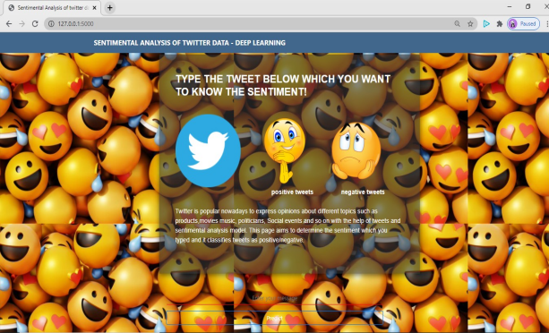
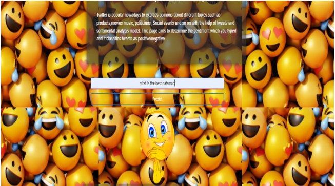

# sentiment alanalysis

&nbsp;&nbsp;&nbsp;&nbsp;&nbsp;&nbsp;&nbsp;&nbsp;&nbsp;&nbsp;&nbsp;&nbsp;&nbsp;&nbsp;&nbsp;&nbsp;&nbsp;&nbsp;&nbsp;&nbsp;&nbsp;&nbsp;&nbsp;&nbsp;
&nbsp;&nbsp;&nbsp;&nbsp;

 
 
<a href="">To view the main page our project click here!</a>
  
<a href="">For project demo click here!</a>

# project description

Twitter has grown in popularity during the past decades. It is now used by millions of users who share information about their daily life and their feelings. In order to automatically process and analyze these data, applications can rely on analysis methods such as sentiment analysis and topic modeling.Developing a program for sentiment analysis is an approach to be used to computationally measure customers' perceptions.

# Solution
The model takes the text as input, pre-processes the text and sends it to the neural network. The neural network classifies the text as 0 or 1 based on whether the text is negative or positive respectively. Using this the sentiment of the person who is sending the tweet can be understood and tweet can be analysed.Then we integrated the model with
Flask web application to make predictions.Finally, we deployed our FLASK app in heroku platform. 

# Core concepts

<b>Category:</b>Deep learning 
<b>concepts:</b>NLP, Sentimental analysis  

&nbsp;&nbsp;&nbsp;&nbsp;&nbsp;&nbsp;&nbsp;&nbsp;&nbsp;&nbsp;&nbsp;&nbsp;&nbsp;&nbsp;&nbsp;&nbsp;&nbsp;&nbsp;&nbsp;&nbsp;&nbsp;&nbsp;&nbsp;&nbsp;
&nbsp;&nbsp;&nbsp;&nbsp;

&nbsp;&nbsp;&nbsp;&nbsp;&nbsp;&nbsp;&nbsp;&nbsp;&nbsp;&nbsp;&nbsp;&nbsp;&nbsp;&nbsp;&nbsp;&nbsp;&nbsp;&nbsp;&nbsp;&nbsp;&nbsp;&nbsp;&nbsp;&nbsp;
&nbsp;&nbsp;&nbsp;&nbsp;

# Languages and framework used

<b>languages used : </b>python, HTML, CSS, Bootstrap 
<b>WebFrameWork used : </b>FLASK 
<b>AI frameworks used : </b>Keras, Tensorflow 
<b>python libraries used:</b>Pandas, Numpy, pickle 
<b>NLP libraries used:</b>NLTK, CountVectorizer 
<b>For deployment :</b>Heroku platform(Salesforces cloud) 

# Outputs

<b>1.Example of positive Sentiment :</b>   
&nbsp;&nbsp;&nbsp;&nbsp;&nbsp;&nbsp;&nbsp;&nbsp;&nbsp;&nbsp;&nbsp;&nbsp;&nbsp;&nbsp;&nbsp;&nbsp;&nbsp;&nbsp;&nbsp;&nbsp;&nbsp;&nbsp;&nbsp;

 
 
<b>2.Example of Negative Sentiment :</b>   
&nbsp;&nbsp;&nbsp;&nbsp;&nbsp;&nbsp;&nbsp;&nbsp;&nbsp;&nbsp;&nbsp;&nbsp;&nbsp;&nbsp;&nbsp;&nbsp;&nbsp;&nbsp;&nbsp;&nbsp;&nbsp;&nbsp;&nbsp;

 
# contributor

Project done by  
s.bala sujith kumar 
